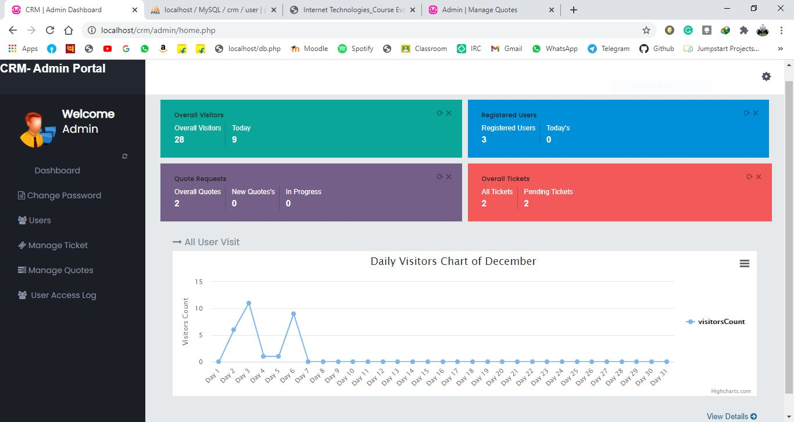

# Web-Development CRM(Customer Relationship Management):

Customer relationship management (CRM) is the process of managing interactions with existing as well as past and potential customers.
This particular CRM helps to manage customers who want to avail web-development services and get quotes.

> Access links for both admin and user are different.

# Installation Steps:

1. Download the zip and extract it to xampp/www/crm  
You can also clone the repo in xampp/www and then rename the directory to crm
2. Create Database named <b>crm</b> and import crm.sql from the root directory of the project
3. Run wamp server

# Links:

CRM User Page: http://localhost/crm/  
Admin Page: http://localhost/crm/admin/

> Note: Both urls are different as both pages contains complete differnet functionality. So, it doesn't make sense to make a single link for login

# Login Details:

## Admin:

```
Login Id: admin
Password: admin
```

## User:

```
Login Id: test@mail.com
Password: Test@1234
```

> By deafault reset password will be the email id in case you forgot it

# Features:

- Ajax Search - http://localhost/crm/admin/manage-quotes.php
- 1st page is index.php (Login page by default). Along with 4 different pages for each user type
- Effective colors, images and font
- HTML, CSS, JS Used
- Login authentication, validation and password-reset
- Insertion, Updation and Ajax search works
- Mobile responsive

# Screenshots:




